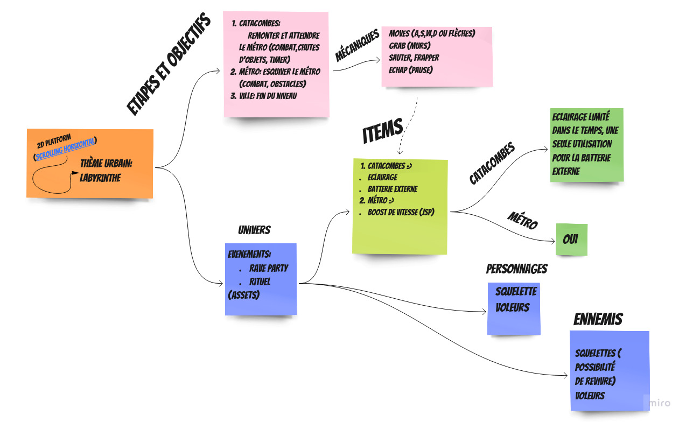

///////// URBEX 

Chef de groupe : Denis
    Donne les instructions et se repose 

Game Design : Johan
    Gere les animations, les deplacements

    Dev graphique : Nicolas 
    S'occupe des decors

    Sound design : Andry
    Toutes les animations, song

MY_IRC : Thomas

///////// THEME 

URBAIN - URBEX VILLE, METRO, CATACOMBS
but du jeu trouver la sortie (labyrinthe)

il fuit la police, il trouve une bouche d'egout, tombe dans un long trou
et il essaie de trouver la sortie

exploration, squelette qui revit, lampe torche du telephone, 

Homme qui se deplace grace a la lumiere de son telephone,
il trouve des objets qu'il peut utiliser, dont des drogues qui font des effets sur l'ecran

evenements : 
-ennemi : squelette qui revit
-rave party : avec lumiere et tout
-rituel bizarre 
-effondrement : il doit esquiver les obstacles

///////////////////////////////////////////////////////////

    

